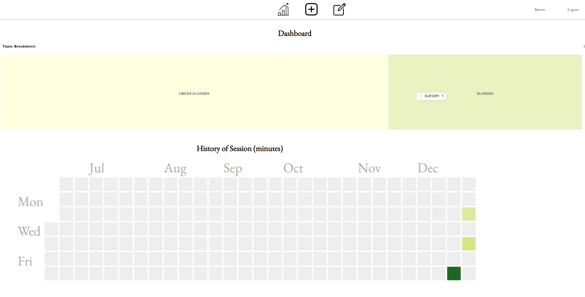
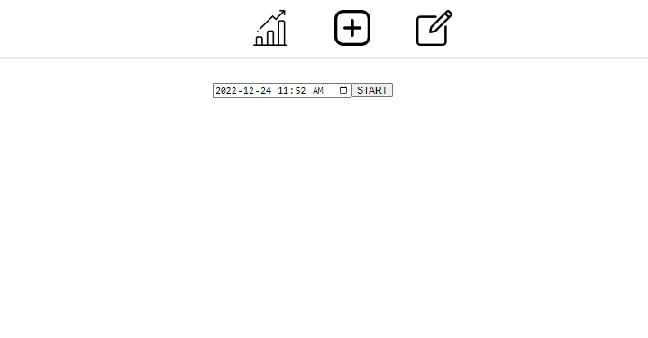
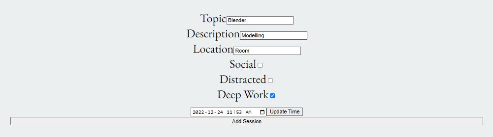
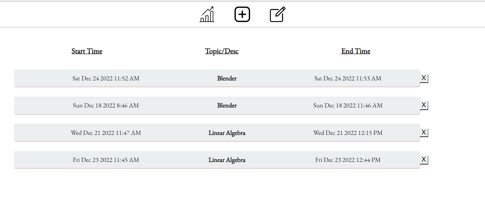
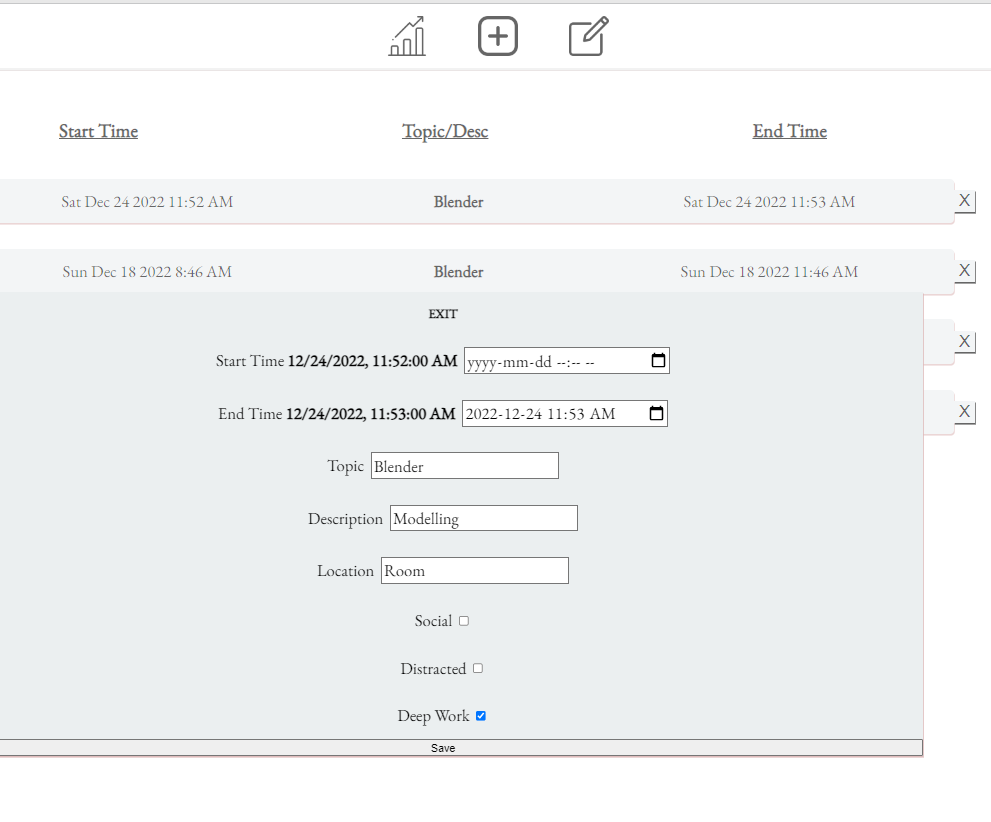

# Study Session Tracker

Live Demo: https://study-session-tracker.onrender.com/signup

Feel free to just signup using a random username / password. This document also outlines the entire application.

### Dashboard

View a breakdown of your study sessions. There are plans to include more graphs that further breakdown your study sessions (including breakdown of location, distractions, deep work, etc).

Currently there is a treemap to see a breakdown of the topics you've studied and a heatmap with the days you've studied and how long.

### Add a Session

Bings up the following form, fill it out (once session is finished):

### Edit / History

### View a Session

### TO DO:

- Add more graphs on the dashboard that give further analysis into study session
- Re-style some of the UI (mainly the forms and dashboard UI)